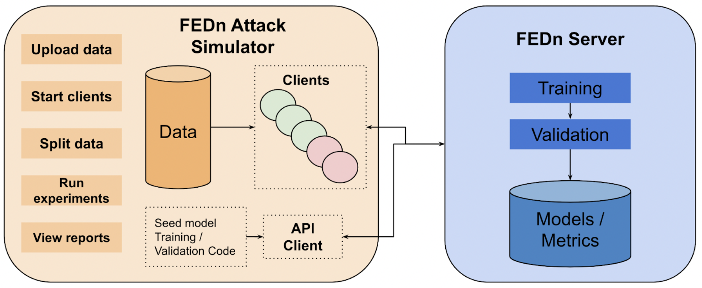
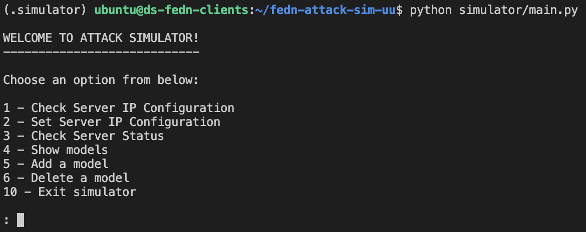

# FEDn Poisoning Attack Simulator

This project was conducted as a component for my master's thesis in the completion of my master's degree in Data Science - Data Engineering track.

The project was to build a poisoning attack simulator for federated learning scenarios for the users to assess the vulnerability of their models to poisoning attacks they define. It was developed on top of the opensource federated learning framework [FEDn](https://github.com/scaleoutsystems/fedn). We implemented the simulator in a way such that a user can add their own implementation of an attack into the framework and run scenarios as simulations.

This repository was forked from the original [FEDn repository](https://github.com/scaleoutsystems/fedn) and the parallel documentation of the forked repository can be found here [here](README_FEDN.rst).

## 1. Simulator Architecture

A conceptual view of the Simulator Architecture is shown below.



The setup in the right-side is the FEDn Server or in other words, the FEDn Combiner which is started up without any changes in the source code from [FEDn](https://github.com/scaleoutsystems/fedn). It is used as the central point for data storage and model aggregation in our simulator setup.

The setup to the left is our architecture for the attack simulator. As of now, we have designed it to run in a single virtual machine only. FEDn clients will be started based on the user's experiment using docker containers. We use FEDn's API Client to communicate with the server.

## 2. Setting It Up

### 2.1 Setting up the FEDn Combiner

STEP 1: Start a virtual machine with sufficient memory and storage capacity for your experiments.

STEP 2: Copy and provide executable permissions for  `initialization/architecture_setup.sh` script within the VM and run it at `/home/ubuntu` level. This will clone the required repository and contextualize the VM with the dependencies. Once this is done, you can navigate into `/home/ubuntu/fedn-attack-sim-uu` and run the following docker compose command to initialize and start up the FEDn Combiner.

```
docker compose up
```

### 2.2 Setting up FEDn Simulator

STEP 1: Start a virtual machine with sufficient memory and storage capacity for your experiments. Consider the maximum number of clients you want to run and decide the flavor of the virtual machine.

STEP 2: Copy and provide executable permissions for  `initialization/architecture_setup.sh` script within the VM and run it at `/home/ubuntu` level. This will clone the required repository and contextualize the VM with the dependencies. Once this is done, you can navigate into `/home/ubuntu/fedn-attack-sim-uu`.

STEP 3: Navigate into `/home/ubuntu/fedn-attack-sim-uu` and initiate the `simulator` venv by running the following script. Provide executable permissions for `/bin/init_venv.sh` if required.

```
./bin/init_venv.sh
```

This will install the dependencies required to run the simulator program which orchestrates the starting and ending of experiments.

Navigate back to `/home/ubuntu/fedn-attack-sim-uu`.

STEP 4: Use the `.simulator` venv to start the `simulator` program.

```
source simulator/.simulator/bin/activate
```

STEP 5: Start the `simulator` program by running the following command.

```
python simulator/main.py 
```

The following menu will be displayed if it is runing successfully.

