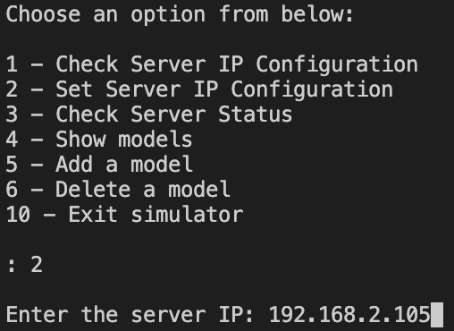
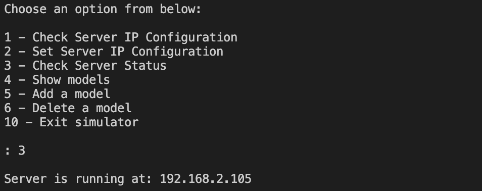
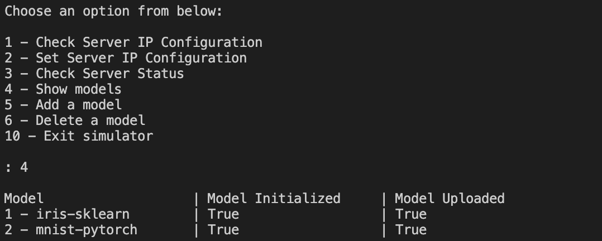
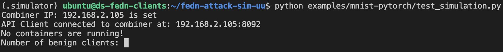
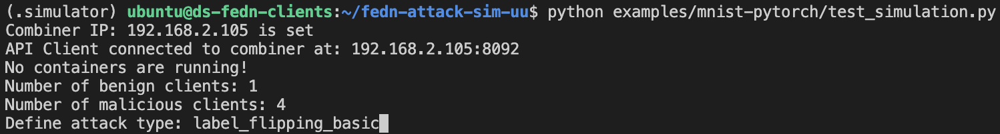
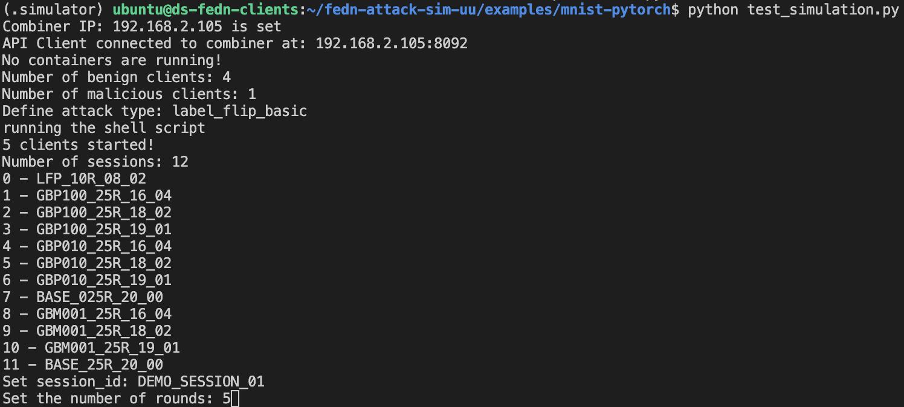
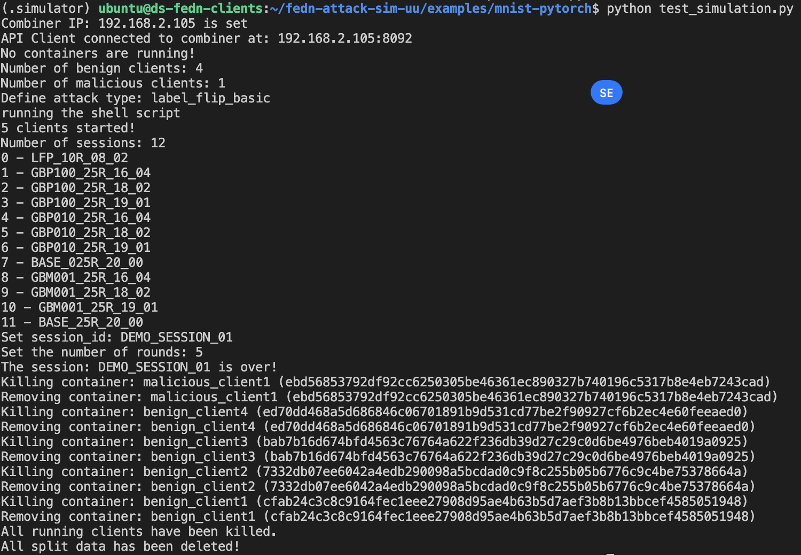

# FEDn Poisoning Attack Simulator

This project was conducted as a component for my master's thesis in the completion of my master's degree in Data Science - Data Engineering track.

The project was to build a poisoning attack simulator for federated learning scenarios for the users to assess the vulnerability of their models to poisoning attacks they define. It was developed on top of the opensource federated learning framework [FEDn](https://github.com/scaleoutsystems/fedn). We implemented the simulator in a way such that a user can add their own implementation of an attack into the framework and run scenarios as simulations.

This repository was forked from the original [FEDn repository](https://github.com/scaleoutsystems/fedn) and the parallel documentation of the forked repository can be found here [here](README_FEDN.rst).

## 1. Simulator Architecture

A conceptual view of the Simulator Architecture is shown below.


The setup in the right-side is the FEDn Server or in other words, the FEDn Combiner which is started up without any changes in the source code from [FEDn](https://github.com/scaleoutsystems/fedn). It is used as the central point for data storage and model aggregation in our simulator setup.

The setup to the left is our architecture for the attack simulator. As of now, we have designed it to run in a single virtual machine only. FEDn clients will be started based on the user's experiment using docker containers. We use FEDn's API Client to communicate with the server.

## 2. Setting It Up

### 2.1 Setting up the FEDn Combiner

STEP 1: Start a virtual machine with sufficient memory and storage capacity for your experiments.

STEP 2: Copy and provide executable permissions for  `initialization/architecture_setup.sh` script within the VM and run it at `/home/ubuntu` level. This will clone the required repository and contextualize the VM with the dependencies. Once this is done, you can navigate into `/home/ubuntu/fedn-attack-sim-uu` and run the following docker compose command to initialize and start up the FEDn Combiner.

```
docker compose up
```

### 2.2 Setting up FEDn Simulator

STEP 1: Start a virtual machine with sufficient memory and storage capacity for your experiments. Consider the maximum number of clients you want to run and decide the flavor of the virtual machine.

STEP 2: Copy and provide executable permissions for  `initialization/architecture_setup.sh` script within the VM and run it at `/home/ubuntu` level. This will clone the required repository and contextualize the VM with the dependencies. Once this is done, you can navigate into `/home/ubuntu/fedn-attack-sim-uu`.

STEP 3: Navigate into `/home/ubuntu/fedn-attack-sim-uu` and initiate the `simulator` venv by running the following script. Provide executable permissions for `/bin/init_venv.sh` if required.

```
./bin/init_venv.sh
```

This will install the dependencies required to run the simulator program which orchestrates the starting and ending of experiments.

Navigate back to `/home/ubuntu/fedn-attack-sim-uu`.

STEP 4: Use the `.simulator` venv to start the `simulator` program.

```
source simulator/.simulator/bin/activate
```

STEP 5: Start the `simulator` program by running the following command.

```
python simulator/main.py 
```

The following menu will be displayed if it is running successfully.


STEP 6: Setup the Server IP Configuration - In order for our simulator to run experiments, it should communicate with a FEDn server / combiner. At this point we have our FEDn combiner running in another VM. We provide the IP of that VM to our simulator for it to enable communication.

Choose Option 1 from the menu by entering `2` and pressing enter. Then enter the IP of the combiner like in this example.



If successfully run, you will see:
```
Successfully saved server IP configuration!
New API server configurations set - API Server at: 192.168.2.105
```

STEP 7: Validate whether the combiner is running by using Option `3`. This will run a script to test the FEDn Client API against the combiner and check whether a response is made. If it is successful you will see the following.



Once all this steps are done, you are ready to run simulations!

## 3. Attack Simulator

Our `simulator` program provides the basic automation required to setup the required folder structure and parameterized scripts to smoothly run an experiment.

### 3.1 Running an experiment (from an example)

Here we use the standard `MNIST PyTorch` experiment available in the original FEDn repository.

In the `simulator` program, run Option `4`to view the existing models avaialble to run experiments.



You can see that in the initial setup, we only have two example models, `iris-sklearn` and `mnist-pytorch` stored in our simulator program. Let us choose `mnist-pytorch` for a demo.

STEP 1: In a different terminal, navigate to folder `/home/ubuntu/fedn-attack-sim-uu` and run the following command (use the .simulator venv):

`python examples/mnist-pytorch/test_simulation.py`

You will see the following menu:



STEP 2: Enter the # of benign clients and # of malicious clients and the attack type defined in the attack implementation code as follows.



This will start up the containers for clients and display the current sessions recorded in FEDn Server as follows. Let's give `DEMO_SESSION_01` as the name for our demo experiment. Press enter and set the number of rounds to 5:



This will start and complete the simulation, saving the results in FEDn Server and will finally kill all the client containers to end the simulation as follows:



### 3.2 Setting up a new model

